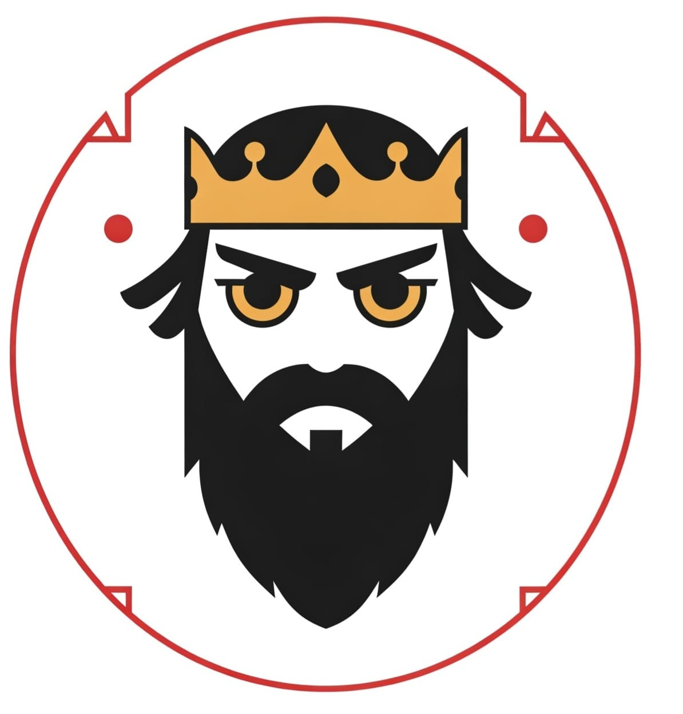

<p align="center">
  
</p>

# Project Name

> ⚡ A brief one-liner about what this project does

## 📚 Table of Contents
- [🎥 Demo](#demo)
- [✨ Features](#features)
- [⚙ Installation](#installation)
- [🚀 Usage](#usage)
- [🧰 Technologies](#technologies)
- [🖼 Screenshots](#screenshots)
- [🪪 License](#license)
- [📬 Contact](#contact)

---

## 🎥 Demo

Coming soon! (Add link to live demo, video, or GIF)

---

## ✨ Features
  -view of AI Model to detect images uploaded to 
  -using ollama vision 3.2
  
---

## ⚙ Installation

```bash
git clone https://github.com/sallot27/project-name.git
cd AIMODEL
cd backend
python app.py
cd ../frontend
npm start

